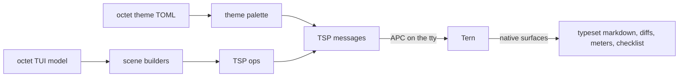

# octet-tern

A [Tern Surface Protocol](https://stencil.so/tern) (TSP) client for octet, and a
retained native backend for octet's model-adaptive themes and interactive shell.

Tern is Stencil's native multiplexing terminal. When a program describes its UI
as semantic data over TSP, Tern draws it natively (real layout, typeset math,
diffs, meters, checklists) instead of consuming ANSI art. This crate gives octet
that path:

- `wire` — the TSP v1 schema: verbs, the 42 component kinds, tones, ops, node
  structure, theme palette, replies and events.
- `frame` — APC framing (`ESC _ tsp;… ESC \`), UTF-8-safe chunking, and a reader
  that reassembles chunked replies/events.
- `client` — Tern detection (`TERM_PROGRAM=tern`) and the surface lifecycle over
  the tty, with credit-based flow control.
- `theme` — projects an octet theme file (`[colors]`/`[tokens]`,
  `[roles."…"]`, `[variants.*]`) onto the Tern theme palette.
- `reconcile` — stable-ID child and property patches without replacing history.
- `scene` — builders for octet's coding surfaces: prompt cards, reasoning
  sections, tool cards with native diffs, the clocked working row, the todo HUD
  and the composer.

## Try it

Inside a Tern pane:

```console
cargo run -p octet-tern --bin octet-tern-demo -- --theme examples/themes/Cards.toml
```

The demo opens an inline surface, sends its palette, and renders a
representative session (transcript, tool cards, working row, composer, todo
HUD). Outside Tern it exits with a note; octet keeps its ANSI path there.

## How the pieces fit



## Scope and limits

octet's interactive renderer exclusively owns a native surface inside Tern;
it does not paint a hidden ANSI TUI. Its flat composer, native completions,
pickers and reports share the existing semantic model and input policy.
Standalone clients and the demo can still use the scene and theme builders.

Tern owns widget geometry, typography and base chrome. Theme variants and
model accents are resolved by octet; arbitrary CSS and exact cell geometry
are outside TSP v1. Historical prompt colors and internally styled extension
content use scoped native ANSI nodes, never a parallel terminal renderer.

See [`docs/tern.md`](../../docs/tern.md) for lifecycle, limits and the headless
protocol/PTY verification lanes.
