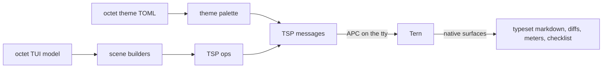

# octet-tern

A [Tern Surface Protocol](https://stencil.so/tern) (TSP) client for octet, and a
proof of concept that octet themes and surfaces render natively inside Tern —
the same way `omp` does.

Tern is Stencil's native multiplexing terminal. When a program describes its UI
as semantic data over TSP, Tern draws it natively (real layout, typeset math,
diffs, meters, checklists) instead of consuming ANSI art. This crate gives octet
that path:

- `wire` — the TSP v1 schema: verbs, the 42 component kinds, tones, ops, node
  structure, theme palette, replies and events.
- `frame` — APC framing (`ESC _ tsp;… ESC \`), UTF-8-safe chunking, and a reader
  that reassembles chunked replies/events.
- `client` — Tern detection (`TERM_PROGRAM=tern`) and the surface lifecycle over
  the tty, with credit-based flow control.
- `theme` — projects an octet theme file (`[colors]`/`[tokens]`,
  `[roles."…"]`, `[variants.*]`) onto the Tern theme palette.
- `scene` — builders for octet's coding surfaces: prompt cards, reasoning
  sections, tool cards with native diffs, the clocked working row, the todo HUD
  and the composer.

## Try it

Inside a Tern pane:

```console
cargo run -p octet-tern --bin octet-tern-demo -- --theme examples/themes/Cards.toml
```

The demo opens an inline surface, sends its palette, and renders a
representative session (transcript, tool cards, working row, composer, todo
HUD). Outside Tern it exits with a note; octet keeps its ANSI path there.

## How the pieces fit



## Scope and limits

This is a proof of concept: it speaks TSP faithfully but it does not yet replace
octet's own TUI loop. The integration seam is a native-surface sink beside
octet's ANSI writer, gated on `client::is_tern()`; the `scene` builders then
consume octet's existing transcript/tool/composer model. Tern owns the
background, fonts and layout, so theme geometry (`[surfaces]`, `[layout]`,
`[glyphs]`) translates to intent rather than exact cells.

See `docs/tern.md` for the protocol details and the octet → Tern token mapping.
